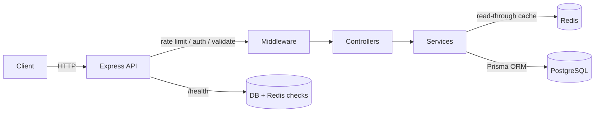
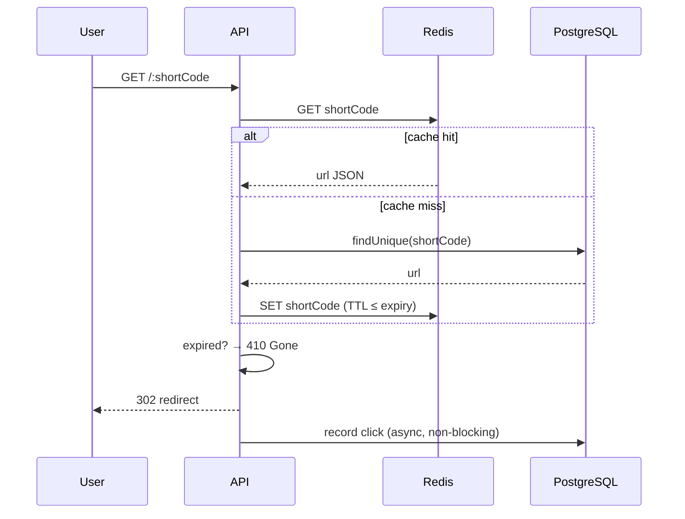
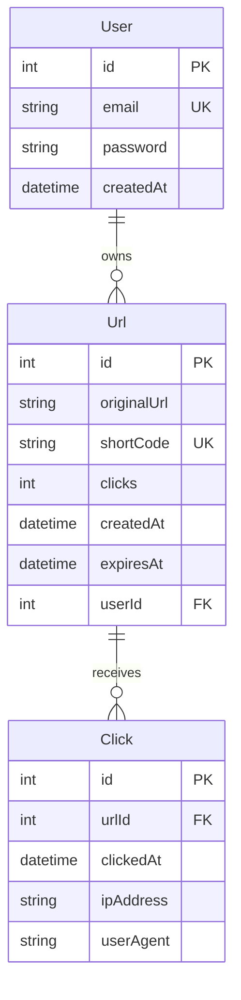

# 🔗 URL Shortener API

A production-style URL shortening service with authentication, click analytics, QR codes, link expiration, Redis caching, and full container/cloud deployment. Built to demonstrate end-to-end backend engineering — from schema design to observability.

> **Live demo:** `https://<your-service>.onrender.com` · **API docs (Swagger):** `https://<your-service>.onrender.com/api-docs`
> _(replace with your Render URL after deploying — see [Deployment](#-deployment))_

---

## ✨ Features

| Domain | Capability |
|---|---|
| **Core** | Shorten URLs with random or custom aliases; collision-safe alias suggestions |
| **Auth** | JWT register/login, bcrypt password hashing, user-owned links (optional anonymous links) |
| **Analytics** | Per-redirect click tracking: total clicks, unique visitors, daily/weekly counts, last accessed, top URLs |
| **QR codes** | On-demand QR generation (base64 JSON or raw PNG), Redis-cached |
| **Expiration** | Expire links by date or after N days; expired links return `410 Gone` |
| **Performance** | Redis read-through cache for redirects with expiry-aware TTL |
| **Security** | Rate limiting, fail-fast env validation, ownership checks |
| **Ops** | `/health` readiness probe (DB + Redis), structured logging, request logging, graceful shutdown |
| **Docs & Tests** | Swagger/OpenAPI, Jest + Supertest test suites |

---

## 🧱 Tech Stack

- **Runtime:** Node.js 20, Express 5
- **Database:** PostgreSQL + Prisma ORM 7 (with `@prisma/adapter-pg`)
- **Cache:** Redis (ioredis)
- **Auth:** JWT, bcrypt
- **Logging:** Winston (structured) + Morgan (HTTP access)
- **Docs:** swagger-jsdoc + swagger-ui-express
- **Testing:** Jest, Supertest
- **Infra:** Docker, Docker Compose, Render Blueprint

---

## 🏛️ Architecture



**Layered request flow** — each layer has one job, which keeps logic testable and swappable:

```
Route ──> Middleware ──> Controller ──> Service ──> Prisma / Redis
(URL map)  (auth,        (HTTP shape:   (business    (persistence
           validation,    parse req,     logic,       + cache)
           rate limit)    send res)      aggregation)
```

### Redirect path (the hot path)



### Data model



---

## 📡 API Reference

Interactive docs at **`/api-docs`**. Summary:

### Auth
| Method | Path | Description |
|---|---|---|
| `POST` | `/auth/register` | Register `{ email, password }` |
| `POST` | `/auth/login` | Login → `{ token }` |

### URLs
| Method | Path | Auth | Description |
|---|---|---|---|
| `POST` | `/shorten` | optional | Create short URL. Body: `{ url, customAlias?, expiresIn?, expiresAt? }` |
| `GET` | `/user` | required | List the caller's URLs |
| `GET` | `/stats/:shortCode` | — | Basic stats for a code |
| `GET` | `/:shortCode` | — | Redirect (`302`), or `410 Gone` if expired |

### Analytics
| Method | Path | Auth | Returns |
|---|---|---|---|
| `GET` | `/urls/:id/analytics` | required | `totalClicks, uniqueVisitors, lastAccessed, dailyClicks, weeklyClicks, clickHistory` |
| `GET` | `/analytics/top-urls` | required | Top 10 most-clicked URLs |

### QR & Expiration
| Method | Path | Auth | Description |
|---|---|---|---|
| `GET` | `/urls/:id/qrcode` | required | QR as base64 JSON (or raw PNG with `?format=png`) |
| `PATCH` | `/urls/:id/expiration` | required | Set/clear expiry. Body: `{ expiresIn }` or `{ expiresAt }` (`null` clears) |

### Ops
| Method | Path | Description |
|---|---|---|
| `GET` | `/health` | Readiness probe — `200 UP` / `503 DEGRADED` with per-dependency status |

**Examples**
```bash
# Shorten with a 7-day expiry
curl -X POST $BASE/shorten -H 'Content-Type: application/json' \
  -d '{"url":"https://example.com","expiresIn":"7d"}'

# QR code as a PNG file
curl "$BASE/urls/1/qrcode?format=png" -H "Authorization: Bearer $TOKEN" -o qr.png

# Change expiration to an absolute date
curl -X PATCH $BASE/urls/1/expiration -H "Authorization: Bearer $TOKEN" \
  -H 'Content-Type: application/json' -d '{"expiresAt":"2026-12-31T23:59:59Z"}'
```

---

## 🚀 Local Setup

**Prerequisites:** Node.js 20+, PostgreSQL, Redis.

```bash
git clone <repo-url> && cd url
npm install
cp .env.example .env          # then fill in the values
npx prisma migrate dev        # create tables
npm run dev                   # nodemon on http://localhost:3000
```

Run the test suite:
```bash
npm test
```

---

## 🐳 Docker Setup

Spin up the API, PostgreSQL, and Redis together:

```bash
docker compose up --build
```

The app is served on `http://localhost:3000`. Compose injects all required env vars (see `docker-compose.yml`). Postgres and Redis data persist in named volumes.

---

## ☁️ Deployment (Render)

This repo ships a **`render.yaml` Blueprint** that provisions the web service, a Postgres database, and a Redis (Key Value) instance together.

1. Push to GitHub.
2. Render Dashboard → **New + → Blueprint** → select the repo.
3. Render reads `render.yaml`, creates all three resources, wires `DATABASE_URL` and `REDIS_URL` automatically, and generates `JWT_SECRET`.
4. After the first deploy, set **`BASE_URL`** to the service's public URL (e.g. `https://url-shortener-api.onrender.com`) so generated short links use the right host.

Key Blueprint choices:
- **Migrations run on deploy** via `npx prisma migrate deploy` in the start command (idempotent, non-interactive).
- **Health checks** point at `/health`, which verifies both Postgres and Redis.
- **Graceful shutdown** on `SIGTERM` lets in-flight requests drain.

---

## 🔐 Environment Variables

| Variable | Required | Description |
|---|---|---|
| `DATABASE_URL` | ✅ | PostgreSQL connection string |
| `JWT_SECRET` | ✅ | JWT signing secret (≥ 32 chars in production) |
| `REDIS_URL` | prod | Redis connection string (defaults to `redis://localhost:6379` in dev) |
| `BASE_URL` | recommended | Public origin used to build short URLs |
| `PORT` | — | Listen port (default `3000`) |
| `NODE_ENV` | — | `development` / `production` |
| `LOG_LEVEL` | — | Winston level override (`info`, `debug`, …) |

Startup runs **fail-fast validation** (`src/config/validateEnv.js`): missing required vars abort the boot with a clear message rather than failing later at runtime.

---

## 📂 Project Structure

```text
├── prisma/                  # Schema + migrations
├── src/
│   ├── app.js               # Express app, middleware, /health
│   ├── config/              # database, redis, logger, swagger, env validation
│   ├── controllers/         # HTTP layer (parse req / shape res)
│   ├── middlewares/         # auth, rate limit, validation, error handling
│   ├── routes/              # Route definitions + Swagger annotations
│   ├── services/            # Business logic (shortening, analytics, QR, expiry)
│   ├── utils/               # ApiError, catchAsync, constants
│   └── validators/          # URL + expiration validators
├── tests/                   # Jest + Supertest suites
├── Dockerfile
├── docker-compose.yml
├── render.yaml              # Render Blueprint
└── server.js                # Entry point (env validation, graceful shutdown)
```

---

## 🧪 Testing Strategy

- **Unit tests** (`url`, `analytics`, `qrcode`, `expiration`) mock Prisma and Redis, so they run fast in CI with no external services — ideal for validating business logic and aggregation wiring.
- **Integration tests** (`auth`, `redis`) exercise real Express routes via Supertest and a live database/cache to catch wiring and serialization issues.
- **Mocking strategy:** `jest.mock()` replaces `src/config/database` and `src/config/redis` at the module boundary, letting tests drive return values and assert call arguments without touching the network.

---

## 📈 Production & Operational Notes

- **Observability:** structured JSON logs (Winston) in production; HTTP access logs (Morgan) piped through the same pipeline; `/health` for uptime monitoring.
- **Scalability:** the redirect hot path is served from Redis; click writes are non-blocking; analytics use indexed aggregation queries. Horizontal scaling is safe because the app is stateless (all state in Postgres/Redis).
- **Resilience:** graceful shutdown, fail-fast config validation, and `410 Gone` semantics for expired links.

---

## 📝 License

ISC
